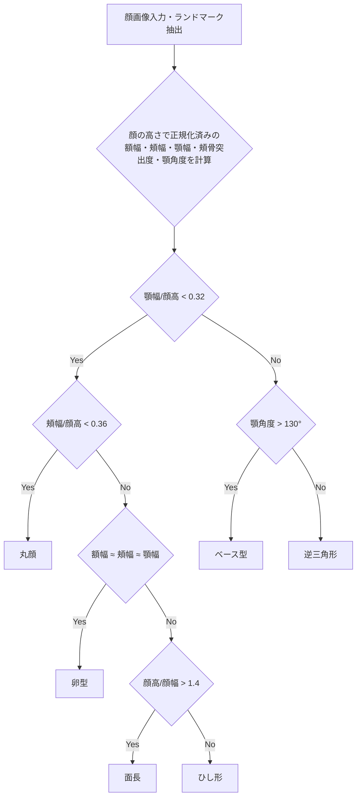

# 顔診断アプリ

カメラ撮影または画像選択で顔を取り込み、MediaPipe Face Mesh から抽出したランドマークをもとに6タイプの輪郭（丸顔／卵型／面長／逆三角形／ベース型／ひし形）を判定するシングルページアプリです。FastAPIがSPA・静的ファイル・REST APIをまとめて提供します。

---

## 目次

- [顔診断アプリ](#顔診断アプリ)
  - [目次](#目次)
  - [概要](#概要)
  - [セットアップ・起動方法](#セットアップ起動方法)
    - [1. uv / make でローカル実行](#1-uv--make-でローカル実行)
    - [2. Docker でローカル実行](#2-docker-でローカル実行)
  - [Renderへのデプロイ](#renderへのデプロイ)
  - [フロントエンド構成](#フロントエンド構成)
    - [画面フロー](#画面フロー)
  - [バックエンド構成・API仕様](#バックエンド構成api仕様)
    - [API一覧](#api一覧)
      - [レスポンス例](#レスポンス例)
      - [ランドマークセット](#ランドマークセット)
  - [顔型判定ロジック](#顔型判定ロジック)
  - [開発・運用メモ](#開発運用メモ)
  - [動作確認チェックリスト](#動作確認チェックリスト)

---

## 概要

- 顔画像から14点のランドマークを抽出し、距離・角度比をもとに6タイプの輪郭を自動判定
- FastAPIによるSPA・静的ファイル・REST API一体型構成
- PC/スマホ両対応、HTTPS環境でカメラ利用可

---

## セットアップ・起動方法

### 1. uv / make でローカル実行

```powershell
git clone <repo>
cd face-app
uv venv .venv
.\.venv\Scripts\activate
uv pip install -r requirements.txt
uvicorn app.main:app --reload --host 0.0.0.0 --port 8000
```

または `make install` → `make run` でも同様に起動できます。`make clean` で仮想環境を削除。

ブラウザで [http://127.0.0.1:8000/](http://127.0.0.1:8000/) を開き、カメラ権限を許可するか、ライブラリアイコンから画像を選択してください。

### 2. Docker でローカル実行

```powershell
docker build -t face-app .
docker run --rm -p 8000:8000 face-app
```

別ポートで公開したい場合は `-p <host_port>:8000` を変更。Makeには `docker-build` / `docker-run` / `docker-stop` ターゲットも用意。

```powershell
make docker-build
make docker-run DOCKER_HOST_PORT=8080  # 例: ホスト側を8080に
make docker-stop  # 終了時
```

---

## Renderへのデプロイ

1. このリポジトリをGitHub/GitLabにプッシュ
2. Renderダッシュボード → **New +** → **Web Service** → 対象リポジトリを選択
3. **Environment**を`Docker`に、**Root Directory**は`.`のまま。Build/Start Commandは空でOK（`Dockerfile`のCMDが使われます）
4. 必要に応じて`PORT=8000`等の環境変数を追加しデプロイ

Render公開後はHTTPSが有効となり、スマホブラウザからもカメラ権限が許可されます。

---

## フロントエンド構成

- `app/templates/index.html` … SPA本体。`screen-*`セクション切替で状態管理
- `app/static/script.js` … Vanilla JS。カメラ起動・画像選択・ランドマーク描画・API通信を担当
- `app/static/style.css` … PC/モバイル両対応のシンプルデザイン。アップロードボタンは`library-icon.png`を参照

### 画面フロー

1. **ホーム (G-1)** – 診断スタートボタン
2. **カメラ/ライブラリ選択 (G-2)** – カメラプレビュー＋撮影ボタン＋ライブラリアイコン
3. **確認 (G-2-1)** – 撮影/選択画像の確認・再撮影
4. **特徴点確認 (G-3)** – ランドマーク描画・再認識・診断開始
5. **ローディング (G-L)** – API呼び出し中
6. **診断結果 (G-4)** – 撮影画像と輪郭ラベルを表示

---

## バックエンド構成・API仕様

- `app/main.py` … FastAPIでエンドポイント・テンプレート・静的ファイルを提供
- MediaPipe Face Mesh（`max_num_faces=1`）で顔ランドマーク抽出、30分間`analysis_store`に保持
- 14点ランドマークから距離・角度比を計算し、6タイプ分類ロジック（`_analyze_face_shape_mediapipe`）で判定
- レスポンスは日本語ラベルのみ（例: "丸顔"）

### API一覧

| Endpoint              | Method | Request内容                                   | Response例                                      | 備考 |
|-----------------------|--------|-----------------------------------------------|-------------------------------------------------|------|
| `/api/face-analyze`   | POST   | `multipart/form-data`で`file`(JPEG/PNG/WebP)  | `{ analysisId, landmarks, quality, faceShape, symmetry, recommendationPreview }` | 14点ランドマーク・自動判定結果 |
| `/api/diagnose`       | POST   | `application/json` `{ analysisId, landmarks? }` | `{ result: { shape } }`                         | セッションID指定・ランドマーク再送可 |
| `/api/health`         | GET    | –                                             | `{ status, timestamp }`                         | ヘルスチェック用 |

#### レスポンス例

```jsonc
// /api/face-analyze
{
  "analysisId": "e5bb...",
  "landmarks": [{"x":140.1,"y":210.5}, ...],
  "quality": {"score":0.82,"message":"撮影状態: 十分な明るさ"},
  "faceShape": "面長",
  "symmetry": {"score":0.74,"label":"バランス良好"},
  "recommendationPreview": "面長さんは横ラインや前髪でバランスを取ると◎。"
}

// /api/diagnose
{ "result": { "shape": "面長" } }
```

#### ランドマークセット

| キー                   | MediaPipe idx | 意味         |
|------------------------|---------------|--------------|
| chin_tip               | 152           | 顎先         |
| jaw_left / jaw_right   | 172 / 397     | 下顎ライン   |
| jaw_corner_left/right  | 234 / 454     | エラ部分     |
| cheek_left / right     | 93 / 323      | 頬骨中央     |
| upper_cheek_left/right | 50 / 280      | 頬骨上部     |
| temple_left / right    | 67 / 297      | こめかみ     |
| forehead_left / right  | 109 / 338     | 額幅         |
| forehead_center        | 10            | 額中央       |

---

## 顔型判定ロジック

顔の高さで正規化した各幅・突出度・顎角度をもとに、以下のフローチャートで6タイプに分類します。



**判定指標凡例**

- 額幅/頬幅/顎幅: 額・頬・顎の横幅（ランドマーク間距離）
- 顔高: 顎先〜額中央の距離
- 頬骨突出度: 頬骨中央の横幅
- 顎角度: 顎角ランドマーク間の角度

※実際の閾値や条件はコード（`_analyze_face_shape_mediapipe`）で微調整されています。

---

## 開発・運用メモ

- `Makefile`あり: `make venv`, `make install`, `make run`, `make clean`
- uv/pipどちらでも依存解決可（既定は`.venv`＋uv推奨）
- カメラアイコンはインラインSVG、ライブラリアイコンは`library-icon.png`（`app/templates/index.html`で変更可）
- iOS/Androidでカメラを使う場合は必ずHTTPSでデプロイ
- 静的ファイルはFastAPIの`StaticFiles`で配信。キャッシュ制御はリバースプロキシ側で設定
- `analysis_store`はメモリ保持。スケールアウト時は共有セッションストア（Redis等）を検討
- 顔画像はメモリ上のみで処理し永続化しない設計。必要ならアップロードディレクトリとライフサイクルを設けること
- カメラAPIはHTTPSでないとモバイルブラウザからブロックされるため、本番は必ずTLSを有効化

---

## 動作確認チェックリスト

1. PC/スマホで「診断スタート」→カメラ表示/ライブラリ選択が機能する
2. 撮影または画像選択→「次へ」で確認画面、「診断開始」でランドマークが描画される
3. `/api/face-analyze`が200を返し、結果画面に日本語ラベル（丸顔など）が表示される
4. 開発者ツールNetworkタブで`/static/*`とAPIレスポンスを確認
5. 必要に応じて`curl http://127.0.0.1:8000/api/health`でヘルスチェック
